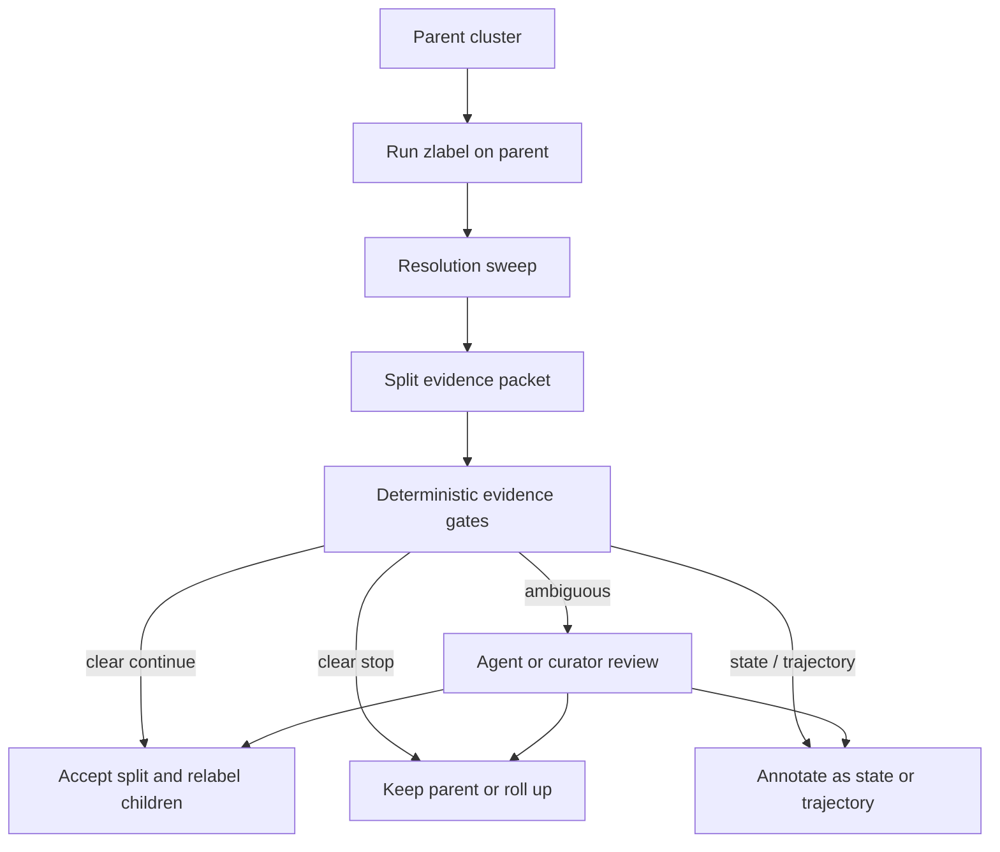

# Recursive Subclustering Controller

Future reference for evidence-driven split, stop, roll-up, and review decisions
above zlabel.

## Bottom line

Recursive subclustering should be controlled by evidence gain, not by a universal
K. Human and atlas-style annotation does not choose one best clustering
resolution; it recursively weighs graph structure, marker evidence, reference
support, topology, label convergence, and practical biological interpretability.

zlabel does not cluster. zlabel produces one evidence-backed label packet from one
marker list plus context. A future controller can call zlabel repeatedly on parent
and child clusters to ask whether a candidate split improves biological evidence.

This document is reference material for future orchestration around zlabel. It
does not define current zlabel behavior, add thresholds, or prescribe a validated
controller. Any formulas, schemas, or score combinations here are candidate design
ideas that need benchmark validation.

## Epistemic buckets

| Bucket                    | Examples                                                                                                                                 |
| ------------------------- | ---------------------------------------------------------------------------------------------------------------------------------------- |
| Established practice      | Broad-to-fine atlas annotation, tissue/lineage reclustering, marker review, reference comparison, and human curation.                    |
| Useful heuristic          | Resolution sweeps, child-size checks, marker separability, cross-resolution stability, label-depth gain, and state-only split detection. |
| Unvalidated future design | A combined recursive controller using zlabel evidence, graph metrics, topology warnings, and benchmark-derived thresholds.               |

## Where this sits

```text
Layer 0: preprocessing and clustering in scanpy/AnnData or equivalent
Layer 1: zlabel one-cluster label packet
Layer 2: notebook orchestration over many clusters
Layer 3: future recursive subclustering controller
Layer 4: curator / agent review interface
```

The recursive controller consumes clustering outputs and zlabel evidence packets,
but it does not belong inside zlabel's marker-to-label core.

## What zebrafish atlases do

Zebrafish atlas practice supports broad-to-fine review rather than one global
resolution.

- **Daniocell** starts from whole-animal wild-type embryos and larvae, assigns
cells to broad tissues, and reanalyzes within tissues. Its amendment workflow
asks for supporting markers, disagreeing markers, literature or ZFIN evidence,
and closest ZFIN anatomy or cell-type equivalent. Source:
[Daniocell](https://daniocell.nichd.nih.gov/).
- **Zebrahub** provides coarse full-dataset and timepoint annotations, then
reprojects, reclusters, and reannotates within high-level lineages. It uses
enriched genes, literature, ZFIN queries, prior scRNA-seq data, and ZFA
vocabulary. Source:
[Zebrahub transcriptomics](https://zebrahub.sf.czbiohub.org/transcriptomics).
- **ZSCAPE** is most useful here through its reference atlas hierarchy. Its
perturbation atlas is better framed as a robustness or stress-test source
because perturbations can confound identity and condition. Source:
[Embryo-scale reverse genetics at single-cell resolution](https://www.nature.com/articles/s41586-023-06720-2).
- **ZCL / scZCL** provides marker support and reference matching, but it is not a
standalone recursion-depth controller. Source:
[ZCL](https://bis.zju.edu.cn/ZCL/).
- **ZFIN, ZFA, and ZFS** provide gene, anatomy, stage, and ontology grounding.
Sources: [ZFIN downloads](https://zfin.org/downloads),
[ZFA](https://obofoundry.org/ontology/zfa.html), and
[ZFS](https://obofoundry.org/ontology/zfs.html).

No validated zebrafish-specific recursive subclustering controller combining
graph metrics, marker separability, topology, and zlabel-style ontology
convergence was found in the literature. That combination should be treated as a
proposed future architecture, not established practice.

## Why single metrics mislead

| Signal                     | Useful for                    | Misleading when used alone                                                |
| -------------------------- | ----------------------------- | ------------------------------------------------------------------------- |
| Leiden resolution          | Candidate granularity ladder  | More clusters does not mean more biology.                                 |
| Modularity / graph quality | Graph community evidence      | Has resolution-limit and technical-artifact failure modes.                |
| Silhouette / separation    | Geometric separation          | Can reward batch/artifact separation or punish continua.                  |
| DE markers                 | Biological separability       | Large datasets make tiny effects significant; state genes can dominate.   |
| Reference matching         | External atlas support        | Stage, platform, and label mismatch can overstate or understate evidence. |
| zlabel confidence/depth    | Biological naming improvement | Deeper is not always better; shallow can be correct.                      |

Useful sources:
[Scanpy Leiden](https://scanpy.readthedocs.io/en/stable/generated/scanpy.tl.leiden.html),
[Scanpy rank_genes_groups](https://scanpy.readthedocs.io/en/stable/generated/scanpy.tl.rank_genes_groups.html),
[Seurat FindSubCluster](https://satijalab.org/seurat/reference/findsubcluster),
[Seurat FindMarkers](https://satijalab.org/seurat/reference/findmarkers),
[clustree](https://lazappi.github.io/clustree/articles/clustree.html),
[Leiden algorithm](https://arxiv.org/abs/1810.08473),
[modularity resolution limit](https://arxiv.org/abs/physics/0607100),
[PAGA](https://genomebiology.biomedcentral.com/articles/10.1186/s13059-019-1663-x),
and [URD](https://github.com/farrellja/URD).

## Evidence families for candidate splits

| Evidence family             | Deterministic artifacts                                                 | Main question                            |
| --------------------------- | ----------------------------------------------------------------------- | ---------------------------------------- |
| Practical gates             | Cell counts, child balance, batch/stage distribution                    | Is the split even supportable?           |
| Graph/stability             | Resolution sweep, cross-resolution persistence, resampling stability    | Is the partition stable?                 |
| Marker separability         | DE, percent in/out, marker specificity, marker reproducibility          | Do children have interpretable markers?  |
| zlabel convergence          | Parent/child confidence, depth, ambiguity, grounding, reference support | Does splitting improve label evidence?   |
| Topology/trajectory         | PAGA/trajectory warning, marker gradients, branch structure             | Is this a discrete split or a continuum? |
| Biological interpretability | Ontology relation, stage plausibility, literature/reference support     | Would a scientist keep this split?       |

Future benchmarks should estimate minimum useful parent size, minimum child size,
required marker strength, stability requirements, and acceptable evidence-gain
thresholds. These should not be hard-coded in this reference.

## Deterministic controller sketch

This is an audit flow, not an algorithmic mandate.

```text
For each eligible parent cluster:

1. Generate candidate local reclusterings across a small resolution ladder.
2. Build a split evidence packet for each candidate resolution.
3. Reject obvious non-starters: too small, unstable, marker-poor, technical,
   state-only, or redundant.
4. Prefer candidate splits that produce stable, marker-separable, better-grounded,
   biologically interpretable children.
5. Route trajectory-like, rare-population, conflicting, or novel cases to
   agent/curator review.
6. Decide: accept split, keep parent, roll up, annotate as state/trajectory, or
   request review.
7. Record evidence and rejected alternatives.
```

## Stop, continue, and review signals

| Decision | Strong signals                                                                                                                                                                                  |
| -------- | ----------------------------------------------------------------------------------------------------------------------------------------------------------------------------------------------- |
| Continue | Parent mixed/unresolved; children stable; robust child markers; child labels become cleaner/deeper; reference agreement improves; topology does not suggest pure continuum slicing.             |
| Stop     | Children get same/synonymous labels; no confidence/depth/grounding improvement; weak markers; state/batch/stress-only split; unstable children; trajectory fragmentation.                       |
| Review   | Rare population possibility; trajectory vs type ambiguity; strong markers but shallow ontology; deep ontology but weak markers; ZFIN/reference disagreement; perturbation or condition effects. |

## zlabel-guided recursion

Candidate future recursion signals from zlabel include the following fields and
derived quantities. They are design inputs for a future controller, not a stable
schema contract.

- `Label.confidence`
- `Label.depth`
- `abstained`
- `ambiguity_flag`
- `next_step`
- `convergent_genes`
- grounding strength
- reference support
- state overlays
- repeated same-label children
- parent-child label improvement

zlabel-guided recursion is plausible, not established. The ingredients are
evidence-supported; the combined controller requires benchmark validation.

## Agentic and curator roles

The deterministic evidence packet is the source of truth. The agent is a reviewer,
summarizer, and router. It may compare hypotheses, explain ambiguity, request
figures, and draft review notes, but it should not invent labels, markers,
ontology IDs, thresholds, or final biological claims.

| Role                | Appropriate tasks                                                                           |
| ------------------- | ------------------------------------------------------------------------------------------- |
| Deterministic spine | Compute metrics, DE, zlabel packets, ontology relations, atlas scores, and pass/fail gates. |
| Agent               | Summarize evidence, identify ambiguity, compare split/stop hypotheses, and request review.  |
| Curator             | Decide novel, ambiguous, trajectory, rare, or condition-confounded cases.                   |

## Minimal-complexity principle

Add only evidence that can change a split, stop, or review decision.

Include early:

- resolution ladder;
- child-size and practical gates;
- marker separability;
- state/technical flags;
- parent-child zlabel comparison;
- simple stability checks;
- reference comparison where available;
- topology warning when trajectory or continuum is plausible.

Avoid initially:

- opaque learned weighting;
- many redundant graph metrics;
- deep trajectory inference for every cluster;
- automatic literature mining for every split;
- complex multi-objective optimization;
- agent-only decision paths.

## Possible future evidence packet shape

The following is a possible future evidence packet shape. It is not a proposed
stable API.

```yaml
recursive_split_record:
  parent:
    cluster_id: string
    n_cells: integer
    label: string
    confidence: string
    depth: integer|null
    ambiguity_flag: string|null

  candidate_split:
    method: leiden
    resolution: float
    n_children: integer
    child_ids: [string]

  evidence:
    practical_gates: [string]
    graph_stability: string|null
    marker_separability: string|null
    zlabel_change: string|null
    reference_change: string|null
    topology_warning: string|null
    state_or_technical_warning: string|null

  decision:
    action: accept_split|keep_parent|roll_up|state_or_trajectory|review
    reasons: [string]
    calibration_status: unvalidated|benchmarked
```

## Benchmark strategy

| Metric family        | Measures                                                                                                          |
| -------------------- | ----------------------------------------------------------------------------------------------------------------- |
| Under-splitting      | Mixed labels retained; low parent purity; child split would improve markers, labels, or reference support.        |
| Over-splitting       | Same-label children; unstable children; weak markers; state/batch/stress-only children; trajectory fragmentation. |
| Depth calibration    | Predicted specificity versus atlas/ontology hierarchy; over-specific versus under-specific calls.                 |
| Marker stability     | Reproducible child markers across resampling/resolution; percent in/out robustness.                               |
| Hierarchy fidelity   | Parent-child ontology consistency; agreement with atlas hierarchy.                                                |
| Practical usefulness | Review burden, false precise labels prevented, mixed clusters routed to subclustering, curator time saved.        |

Recommended benchmark sources:

| Source                    | Best use                                                        |
| ------------------------- | --------------------------------------------------------------- |
| Daniocell                 | Broad tissue and tissue-specific recursion behavior.            |
| Zebrahub                  | Coarse-to-lineage refinement and developmental-stage hierarchy. |
| ZSCAPE reference atlas    | Hierarchy/depth benchmarking.                                   |
| ZSCAPE perturbation atlas | Robustness and stress testing only.                             |
| ZCL / scZCL               | Reference-match support and marker comparison.                  |

## Epistemic status

| Claim                                                                                                                   | Status                    | Basis                                                                                                                                 |
| ----------------------------------------------------------------------------------------------------------------------- | ------------------------- | ------------------------------------------------------------------------------------------------------------------------------------- |
| Zebrafish whole-organism atlases use broad-to-fine local annotation rather than one global best K.                      | Established practice      | Daniocell, Zebrahub, and ZSCAPE all describe broad grouping followed by tissue, lineage, or major-group refinement.                   |
| Human/atlas annotation uses markers, literature or database evidence, ontology terms, stage context, and manual review. | Established practice      | Daniocell amendment guidance, Zebrahub annotation notes, and ZSCAPE methods all describe evidence review beyond top expression alone. |
| Symbol normalization and ontology-aware grounding are required before on-the-fly naming can be trusted.                 | Established practice      | ZFIN exposes previous names, IDs, marker relationships, orthology files, and ontology-structured expression resources.                |
| A single metric such as silhouette, modularity, or DE significance is insufficient to control recursion depth.          | Established in principle  | Single metrics capture one failure mode and can miss continua, technical artifacts, or small biological populations.                  |
| Deterministic split evidence packets plus agent/curator review are the right architecture.                              | Plausible design judgment | This matches atlas practice and zlabel's evidence-packet architecture, but the combined controller is not implemented or benchmarked. |
| zlabel confidence gain, ontology-depth gain, and grounding improvement are useful recursion signals.                    | Plausible heuristic       | These align with the project thesis but need ablation against scanpy-only and marker-only controllers.                                |
| Exact thresholds for cell counts, marker strength, stability, label gain, and topology warnings are known.              | Not proven                | They need dataset- and stage-aware benchmark calibration.                                                                             |
| A combined controller will outperform scanpy-only or atlas-only heuristics across zebrafish datasets.                   | Unvalidated future design | This is the benchmark question, not a current claim.                                                                                  |

## Validation experiments

The shortest path from plausible design to evidence is an ablation benchmark. Start
with simple variants and ask whether each one reduces under-splitting,
over-splitting, or review burden.

| Experiment                                     | What it tests                                                                                    |
| ---------------------------------------------- | ------------------------------------------------------------------------------------------------ |
| No recursion                                   | Baseline: how often broad clusters remain mixed or shallow.                                      |
| Scanpy-only recursion                          | Whether graph resolution and practical gates alone are enough.                                   |
| DE-only recursion                              | Whether marker separability alone over-splits states, gradients, or artifacts.                   |
| zlabel-guided recursion                        | Whether parent-child label packets improve split/stop decisions without graph stability.         |
| Combined controller                            | Whether graph, marker, topology, reference, and zlabel evidence improve together.                |
| Global vs stage-conditioned grounding          | Whether stage-aware ZFIN/ZFA/ZFS evidence improves developmental depth decisions.                |
| Wild-type hierarchy first, perturbation second | Whether the controller works on clean reference structure before condition-shifted stress tests. |
| Hard-continuum review set                      | Where deterministic rules fail on trajectories, rare populations, and ambiguous lineages.        |

Do not treat any controller as successful unless it improves the balance between
under-splitting and over-splitting while preserving reviewable evidence. Runtime
and curator burden also matter: a more complex controller is only useful if it
changes real split, stop, or review decisions.

## Open questions

| Open question           | Why unresolved                                                                                              |
| ----------------------- | ----------------------------------------------------------------------------------------------------------- |
| Thresholds              | Minimum cell counts, marker strength, stability, and evidence-gain requirements need benchmark calibration. |
| Trajectory vs type      | Continuous developmental transitions can look like clusters.                                                |
| Rare populations        | Small clusters can be real or noise.                                                                        |
| State-only splits       | Some state splits are useful overlays but not identity refinements.                                         |
| zlabel-guided recursion | Needs ablation against scanpy-only and marker-only recursion.                                               |
| Perturbation handling   | Condition effects can mimic identity differences.                                                           |

## Controller loop



## Final positioning

This reference describes a future evidence-driven controller for recursive
subclustering. Zebrafish atlas practice supports broad-to-fine review, and
single-cell tooling supports resolution sweeps, subclustering, marker testing,
reference comparison, and topology checks. What is not yet proven is the combined
controller. The near-term goal is deterministic split evidence packets plus
explicit stop/continue/review routing. The long-term goal is to benchmark whether
zlabel-guided recursion reduces both under-splitting and over-splitting compared
with scanpy-only heuristics.
